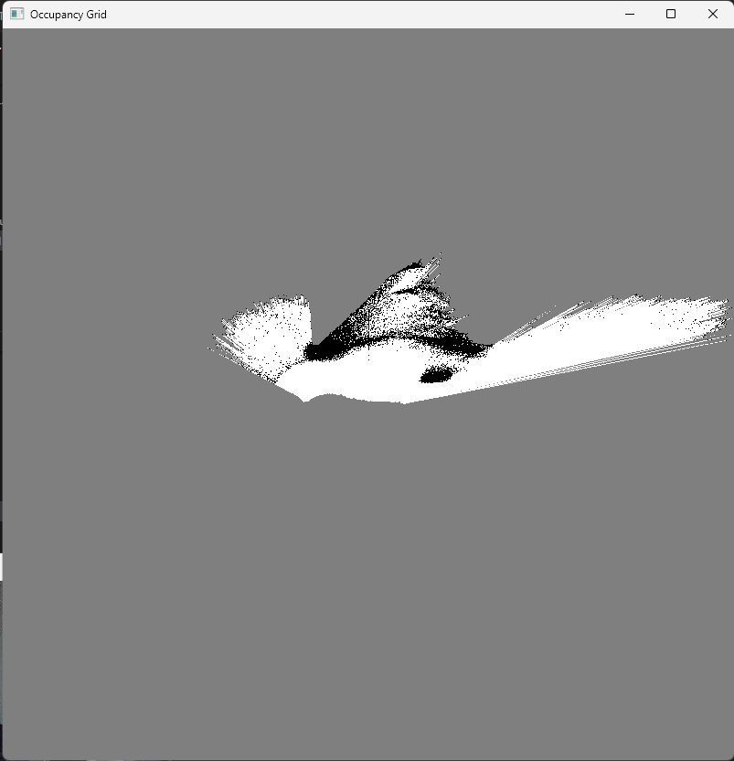

# 3. SLAM System

This directory contains the codes and results of the Visual SLAM (Simultaneous Localization and Mapping) implementation.

## Contents
- **src:** Python codes for the SLAM algorithm.
- **results:** SLAM mapping results and photos of the real environment.

## Method
In this project, a Python-based Visual SLAM algorithm is implemented using image data received from the ESP32-CAM.

### Results

#### 2D Map (X-Z)

#### Occupancy Grid

#### Real Environment and Obstacles
