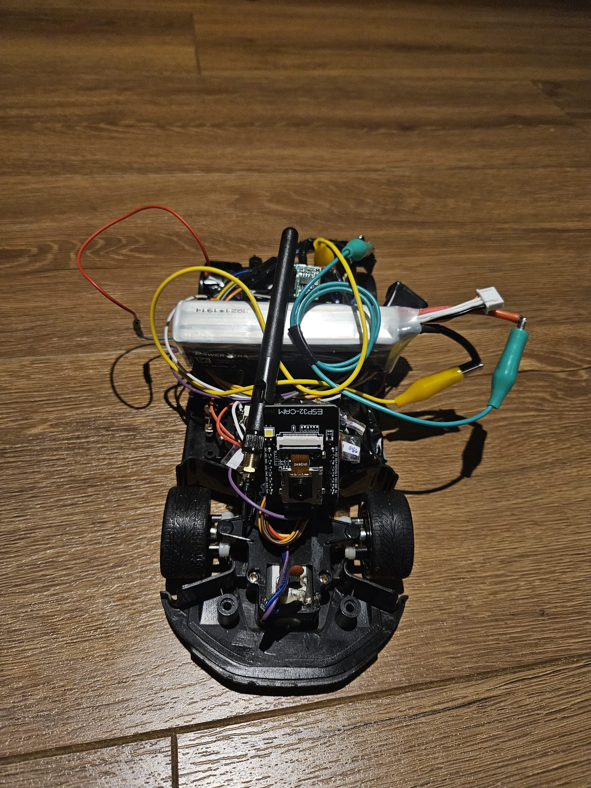

# RC Car Project (ESP32-CAM & SLAM & Flutter)

This project is a comprehensive autonomous/semi-autonomous vehicle platform that merges the disciplines of image processing, embedded systems, and mobile application development. The primary goal is to investigate the feasibility of performing SLAM (Simultaneous Localization and Mapping) using only a single camera (Visual SLAM) with low-cost hardware (ESP32-CAM), a task typically reserved for expensive sensors like LIDAR.

---

## 🚧 Project Status: Active Development

This project goes beyond a hobbyist endeavor; it is an R&D effort focused on real-time data processing and wireless communication.

### Current Developments
*   **SLAM Algorithm Comparison:** Performance comparisons (FPS vs. Accuracy) between **ORB (Oriented FAST and Rotated BRIEF)** and **AKAZE** algorithms are being conducted for visual odometry. The balance between image compression ratio (due to ESP32 bandwidth limits) and feature loss is being optimized.
*   **Mechanical Improvements:** Vibrations occurring while the vehicle is in motion (Rolling Shutter effect) cause "pose loss" in the SLAM algorithm. A damping system with sponge support is being designed for the camera module to prevent this.
*   **Communication Protocol:** While TCP/IP-based HTTP streaming is reliable, handshaking times can introduce latency. Work is underway on **UDP**-based image transmission for lower latency.

---

## 🛠 Technical Architecture & Details

### 1. [Embedded System](./1_Embedded_System/README.md) - Hardware Layer
The nervous system of the vehicle is the ESP32-CAM module.
*   **Dual Core Utilization:** The dual-core architecture of the ESP32 is utilized efficiently. The `APP_CPU` (Core 1) manages the main loop and Wi-Fi communication, while the `PRO_CPU` (Core 0) handles data reading from the camera sensor.
*   **Motor Driver Logic:** The TB6612FNG allows us to control motor speed like an analog signal using PWM (Pulse Width Modulation). Unlike the L298N, its MOSFET output ensures energy efficiency around 95%.
*   **Power Regulation:** 3x 18650 batteries (in series, ~12V) are used. Voltage is efficiently stepped down to 5V and 3.3V using the LM2596 "Buck Converter" without excessive heat loss.

### 2. [Mobile App (Flutter)](./2_Flutter_App/README.md) - Control Layer
User experience-focused control interface.
*   **State Management:** Real-time data flow (speed, connection status) within the app is managed via the **Provider** package. This prevents unnecessary "Widget Rebuilds," ensuring high FPS.
*   **Asynchronous Communication:** Video streaming and control commands run entirely on asynchronous (Future/Stream) structures. The UI thread is never blocked while processing video packets.

### 3. [SLAM System](./3_SLAM_System/README.md) - Perception Layer
How the vehicle perceives the world.
*   **Monocular Visual SLAM:** Estimating depth with a single camera is challenging. In this project, "Epipolar Geometry" calculations are performed using "Pixel Motion" (Optical Flow) between consecutive frames and known camera parameters (Intrinsic Matrix).
*   **Loop Closure:** When the vehicle recognizes a previously visited location (using Bag of Words technique), it retroactively corrects accumulated drift errors in the map.

---

## 📸 Vehicle View

